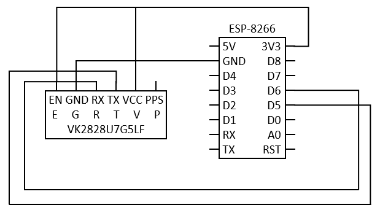
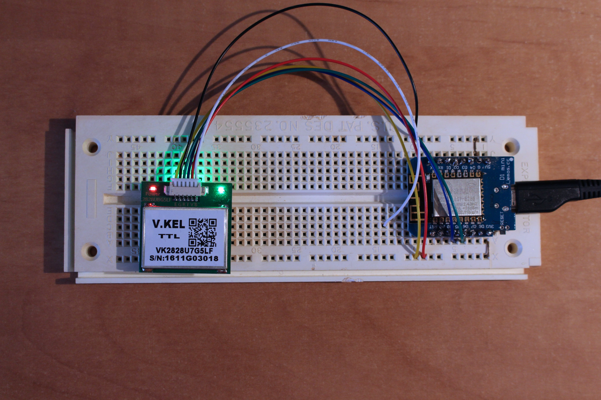

# ESP-8266 GPS

The VK2828U7G5LF is a GPS module with an integrated antenna, receiver and decoder. It can talk with the ESP-8266 through serial communication and provides very useful information on geolocation: latitude, longitude, altitude, universal date and time.

This circuit diagram shows the connection between the GPS module and the ESP-8266:



We arbitrarily choose available pins D5 and D6 to make the serial communication with the GPS module. D5 receives data (RX) and D6 transmit data (TX). Default baud rate is 9600 bps and could be configured from 1200 to 921 600 bps.


```
#include <SoftwareSerial.h>

// Set the data rate for the SoftwareSerial port
SoftwareSerial GPS_Serial(D5, D6); // RX, TX

int i=0,k=0;
int  gps_status=0;
String latitude=""; 
String logitude="";                       
String gpsString="";
char *test="$GPGGA";

void setup() 
{
  Serial.begin(9600);
  while (!Serial) {
    ; // wait for serial port to connect. Needed for native USB port only
  }
  // Set the data rate for the GPS serial port
  GPS_Serial.begin(9600);
  
}

void coordinate2dec()
{

  Serial.println(gpsString);
    
  // Extract latitude from string
  String lat_degree = "";
  for(i = 17; i < 19; i++) lat_degree += gpsString[i];
  String lat_minut = "";
  for(i = 19; i < 27; i++) lat_minut += gpsString[i];
    
  // Extract longitude from string
  String long_degree = "";
  for(i = 30; i < 33; i++) long_degree += gpsString[i];
  String long_minut = "";
  for(i = 33; i < 41; i++) long_minut += gpsString[i];
  float minut = lat_minut.toFloat();
  minut = minut/60.0;
  float degree = lat_degree.toFloat();
  Serial.println(100000 * (degree + minut));
  latitude = degree+minut;
     
  minut = long_minut.toFloat();
  minut = minut/60.0;
  degree = long_degree.toFloat();
  Serial.println(100000 * (degree + minut));
  logitude = degree + minut;
}

void gpsEvent()
{
  gpsString = "";
  while(1)
  {
    // Serial incoming data from GPS
    while (GPS_Serial.available()>0)                
    {
      char inChar = (char)GPS_Serial.read();
      // Store incoming data from GPS to temporary string str[]
      gpsString+= inChar;                    
      i++;
      if (i < 7)                      
      {
        // Check for right string
        if(gpsString[i-1] != test[i-1])       
        {
          i = 0;
          gpsString = "";
        }
      }
      if(inChar=='\r')
      {
        if(i>65)
        {
          gps_status=1;
          break;
        }
        else
        {
          i=0;
        }
      }
    }
    if(gps_status) break;
  }
}

void get_gps()
{
  gps_status = 0;
  int x = 0;
  while(gps_status == 0)
  {
    gpsEvent();
    int str_lenth = i;
    latitude = "";
    logitude = "";
    coordinate2dec();
    i = 0; x = 0;
    str_lenth = 0;
  }
}

void show_coordinate()
{
  Serial.print("Latitude:");
  Serial.println(latitude);
  Serial.print("Longitude:");
  Serial.println(logitude);
}

void loop() 
{
  k=0;
  while(k<1000)
  {
    k++;
    get_gps();
    show_coordinate();
    delay(1000);
  }
}
```


